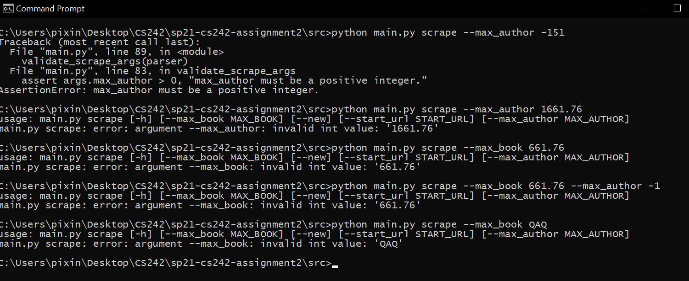

# sp21-cs242-assignment2 (Web Scraping)

## Table of Contents

* [Introduction](#Introduction)
* [Requirements](#Requirments)
* [Test Scrape](#TestScrape)
* [Test Update](TestUpdate)
* [Test Export](TestExport)
* [Test Draw](TestDraw)

## Introdution

This is the first part of the GoodRead web scraping MP (CS242@illinois).

Currently implements the following functionalities:

- Given a good read book page url (e.g. https://www.goodreads.com/book/show/1151966.Gulf_Breeze), collect

  ```["book_url", "book_title", "cover_url", "rating_value", "book_id",
  ["book_url", "book_title", "cover_url", "rating_value", "book_id", "rating_count", "review_count", "author_name", "author_url","ISBN", "similar_book_urls"]
  ```

  of the given book and store into MongoDB.
- From the `author_url` collected in the previous step, collect

  ```["author_name", "author_id", "author_url", "rating_count", "review_count",
  ["author_name", "author_id", "author_url", "rating_count", "review_count", "rating_value", "image_url", "related_author","author_books"]
  ```

  of the given author and insert to MongoDB
- From the `similar_book` provided retrieved in step 1, do a BFS to collect books and authors.
- Based one the collected data, there are four additional commands provided in src/main.py - (i) scrape; (ii) update; (iii) export; (iv) draw
- (i) Scrape: Start new scraping with provideda start_url, or continue the progress from last time (stored in dir progress as pkl files).
- (ii) Update: Safely update value of existing object in MongoDB, or create new instance and insert into DB.
- (iii) Export: Export remote MongoDB to local json file.
- (iv) Draw: Draw a book-author network using networkx.

## Requirements

BeautifulSoup4 == 4.9.3

pymongo==3.11.3

requests==2.18.4

networkx==2.5

OS: Windows

Notice these are only environment where this software got developed and is guranteed to run. They are not meant to be hard requirements.

Also notice one will have to have access to the author's remote MongoDB to actually run with existing DB. Otherwise please configure the MongoDB setting properly to run!

## Test Scrape

```bash
usage: main.py scrape [-h] [--max_book MAX_BOOK] [--new] [--start_url START_URL] [--max_author MAX_AUTHOR]

optional arguments:
  -h, --help            show this help message and exit
  --max_book MAX_BOOK   Stop scraping if DB book storage >= max_book and author storage >= max_author, default=200.
  --new                 Whether or not to start new scraping
  --start_url START_URL
                        The start point of bfs for new book scraping.
  --max_author MAX_AUTHOR
                        Stop scraping if DB book storage >= max_book and author storage >= max_author, default=50.
```

### 1.1 Unit Tests for BookScraper

Unit tests for `book_scraper.py` (which provides part of the true functionality of `python main.py scrape`) can be found in `src/book_scraper_test.py`.

It currently covered the following scenarios:

- Invalid input book url that does not have prefix "https://www.goodreads.com/book/show/" should return an None object, not a dictionary. For example, "https://www.google.com".
- Test invalid book url input with valid prefix (as above), but actually not exists (for example, "https://www.goodreads.com/book/show/61asd21") , the process should finish successfully, return a dictionary object (not None). However, all values of the book dictionary should be None.
- Test valid book url input, but whose ISBN is not retrievable. The process should successfully finish, and all values except ISBN should be correctly scraped. ISBN should be None.
- Test valid book url input without any missing data, the scraping should succeed and every value should be correct.


### 1.2 Unit Tests for AuthorScraper

Unit tests for `author_scraper.py` (which provides part of the true functionality of `python main.py scrape`) can be found in `src/author_scraper_test.py`.

It currently covered the following scenarios:

- Invalid input author url that does not have prefix "https://www.goodreads.com/author/show/" should return an None object, not a dictionary with all values None. For example, "https://www.google.com".
- Test invalid author url input with valid prefix (as above), but actually not exists (for example, "https://www.goodreads.com/book/show/21167-Frederick") , the process should finish successfully, return a dictionary object (not None). However, all values of the book dictionary should be None.
- Test valid author url input without any missing data, the scraping should succeed and every value should be correct.


### 1.3 Test Scrape Invalid Usage with main.py

Principles for `--new` is on:

- When the switch `--new` is provided, `--start-url` should also be provided. Otherwise parser error should be invoked.
- `--start_url`  the url should be start with`https://www.goodreads.com/book/show/` to be good in shape. Otherwise assertion error should be invoked.


Principles for `--new` is off:

Even if the user runs scrape without any arguments (i.e. `python main.py scrape`), the code should run as long as `bfs_queue.pkl`, `visited_books.pkl`, `visited_authors.pkl` stored in `../progress` directory exists.

If the pickle files are not existing (for example, if I rename my `progress` dir as `progress_`),  an assertion error should occur as shown below.


Now I get my `progress` dir back, the run should succeed, although the default `max_book=200` has already been reached. In Test 2.5 we will demonstrate the running of larger `max_book` so that the program actually scrape a new book.


### 1.4 Test Scrape Bad Numerical Values with main.py

Pinciples (regardless of --new):

- max_author >= 2000 should cause assertion error.
- max_book >= 2000 should cause assertion error.
- max_author is not integer (float or string) should cause parser error.
- max_book is not integer (float or string) should cause parser error.

The below invalid runs all caused corresponding error.





### 1.5 Test Scrape Good Shape but invalid start_url


NOTE: There are already 242 books in the remote MongoDB, so we will first need to setmax_book to 243 to do this test.

The scraping failed as expected, and this data won't be stored into DB. As shown below, the current stored book is still 242 after the failed scraping.

Even if one scrpaing fails, the **process can still gracefully continue - from the stored progress**.


### 1.6 Test Scrape Continued Scraping with main.py

If the user did not input the `--new` switch (i.e. run with `python main.py scrape --max_book x --max_author y`), the program will run from where it left last time (by loading `../progress/*.pkl`).

To eye-check the success of this, here's a simple fact: the current 244  books are retrieved by three times (200 + 42 + 2). The logging for first 200 scraping can be found in `../progress/progress.log`. Please refer to that file for this manual test. **Books whose ISBN are not extractable are also properly logged** in that file.

Here's an example of scraping one more (245 th book):


We can now check and see our MongoDB. The newly scraped page gets properly stored as below.


Finally, we can confirm that every piece of book information are scraped correctly.

E.g. All highlighted parts have the same value!


### 1.7 Test Scrape Robustness with main.py

`../progress/progress.log` should serve as a good proof for the robustness of the scraping.

Notice it's generated with `python main.py scrape --new --start_url https://www.goodreads.com/book/show/3735293-clean-code`.

## Test Update

```bash
usage: main.py update [-h] --srcJSON SRCJSON [--type {book,author}]

optional arguments:
  -h, --help            show this help message and exit
  --srcJSON SRCJSON
  --type {book,author}  Flag indicating input json file stores book or author information
```

It currently covered the following scenarios:

### 2.1 Unit Tests for Update

Unit tests for `update.py` (which provides the true functionality of `python main.py update`) can be found in `src/update_db_test.py`.

It currently covered the following scenarios:

- Malformed JSON file - i.e. The input json file is not parseable. For example, the JSON file might miss brackets or comma.
- Object stored in JSON misses some keys compared with the storage in remote MongoDB. For example, a JSON file with a valid book dictionary containing no `book_url`.
- With a JSON that stores ***single dictionary (not list)*** and complete set of arguments, and suppose this object ***is not in DB yet***, the JSON object could be succesfully inserted to remote DB.
- With a JSON that stores ***a list of dictionaries*** and complete set of arguments, and suppose these objects ***are not in DB yet***, the JSON objects could be succesfully inserted to remote DB.
- With a JSON that stores ***single dictionary (not list)*** and complete set of arguments, and suppose this object ***is already in DB***, the value of object in remote DB could be successfully updated.
- With a JSON that stores a ***list of dictionaries*** and complete set of arguments, and suppose these objects ***are alreay in DB yet***, the value of objects in remote DB could be successfully updated.


### 2.2 Test Update Invalid Usage

Principles:

- `--srcJSON` must be provided or parser error will be invoked.
- `--type` must be provided or parser error will be invoked.
- `--type` must be chosen from one of the `["author", "book"]`, otherwise parser error will be invoked.


### 2.3 Test Update Non-Existing File with main.py

If user provides a non-existing JSON file, the insertion should fail.

**NOTE**: All JSON files should be stored in ../JSON directory.


### 2.4 Test Update Malformed JSON with main.py

When attempts to give main.py a malformated json file, i.e. missing "{", "]" or etc., the insertion should fail.

**NOTE**: All JSON files should be stored in ../JSON directory.


### 2.5 Test Update Missing Keys JSON with main.py

When attempts to give main.py a json file in which the keys or some objects are not recorded (compared with the keys stored remote MongoDB), i.e. missing "{", "]" or etc., the insertion should fail.

**NOTE**: All JSON files should be stored in ../JSON directory.


### 2.6 Test Create/Update with main.py

When user provides main.py good JSON files, the update/insertion should succeed.

Notice the `*.json` used here are

**NOTE**: All JSON files should be stored in ../JSON directory.


## Test Export

```bash
usage: main.py export [-h] --db {book,author,all}

optional arguments:
-h, --help            show this help message and exit
--db {book,author,all}
The database user wants to export
```

### 3.1 Test Export with Invalid Arguments with main.py

Principles:

- User must input one switch: `--db`.
- There are only three legal values can be chosen from - `["book", "author", "all"]`
- Any other input will cause parser error.


### 3.2 Test Export Author with main.py

Modification time of `author_db.json` demonstrates the success.


### 3.3 Test Export Book with main.py

Modification time of `book_db.json` demonstrates the success.


### 3.4 Test Export All with main.py

Modification time of `author_db.json` and `book_db.json` demonstrate the success.


## Test Draw (Bonus)

```bash
usage: main.py draw [-h]

optional arguments:
  -h, --help  show this help message and exit
```

### 4.1 Draw Test with main.py

Setting work dir to src, and run with

```bash
python main.py draw
```


We can see a image ploted by matplotlib on screen;


we should find a copy of "graph.jpg" stored in directory `../graph_image`.

Notice there's no other arguments required for runnig this command.
