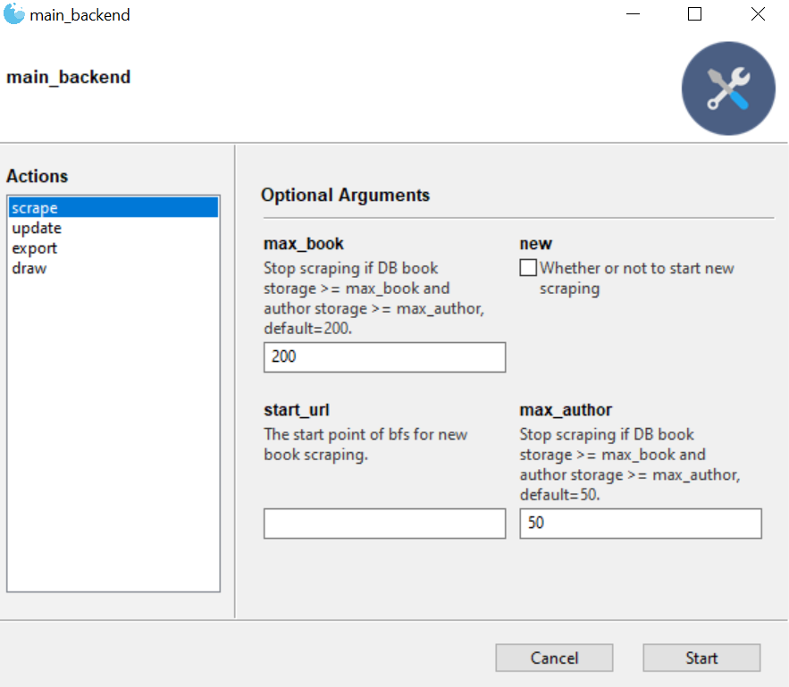
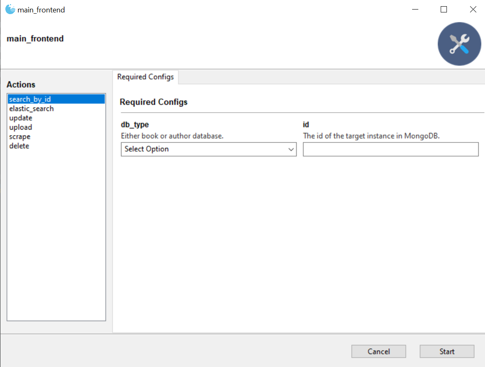

# sp21-cs242-assignment2 (Web Scraping)

Table of Contents
-----------------

* [Functionality](#Functionality)
* [Environment](#Environment)
* [Overrided Elastic Search]()
* [Run](Run)
* [Remote Server]()

## Functionality

This is the GoodRead MP for CS242@illinois.

### Part 0

Assignment-2.0 implements the following functionalities:

- Given a good read book page url (e.g. https://www.goodreads.com/book/show/1151966.Gulf_Breeze), collect

  ```["book_url", "book_title", "cover_url", "rating_value", "book_id",
  ["book_url", "book_title", "cover_url", "rating_value", "book_id", "rating_count", "review_count", "author_name", "author_url","ISBN", "similar_book_urls"]
  ```

  of the given book and store into MongoDB.
- From the `author_url` collected in the previous step, collect

  ```["author_name", "author_id", "author_url", "rating_count", "review_count",
  ["author_name", "author_id", "author_url", "rating_count", "review_count", "rating_value", "image_url", "related_author","author_books"]
  ```

  of the given author and insert to MongoDB
- From the `similar_book` provided retrieved in step 1, do a BFS to collect books and authors.
- Based one the collected data, there are four additional commands provided in src/main.py - (i) scrape; (ii) update; (iii) export; (iv) draw
- (i) Scrape: Start new scraping with provideda start_url, or continue the progress from last time (stored in dir progress as pkl files).
- (ii) Update: Safely update value of existing object in MongoDB, or create new instance and insert into DB.
- (iii) Export: Export remote MongoDB to local json file.
- (iv) Draw: Draw a book-author network using networkx.

### Part 1

Assignment-2.1 implements the following functionalities:

- Type conversion for scraping. Assignment-2.0 will store `rating_count`, `review_count`, `rating_value` as string, which is not numerically comparable. In this part, they will be stored as numeric upon scraping.
- An interpreter for ElasticSearch language. This will be useful for convenient query to the database. It support basic query in the form of `db_name.query_attr : "query_value"`, comparison operators `>, <, NOT` , logic connection operators `AND, OR`, and wildcard operators in query_attr and query_value.
- A backend server that will listen to clients' `GET, POST, PUT, DELETE` requests. More specifically, the server handles the following behavior:
  - `search_by_id(GET)` Access instances by their `_id` attribute.
  - `elastic_search(GET)` Access instances by a elastic search query string.
  - `upload(POST)` Insert new instance to remote database based on data in request body. If instance already exists, its value will be updated.
  - `update(PUT)` Update attribtue values of existing instances based on data in request body.
  - `scrape(POST)` Request the server to scrape for a certain amount of books or authors and insert results into database.
  - `delete(DELETE)` Remove instances from remote database specified by `_id`.
- Implement a tree-structured interactive GUI for frontend clients to conveniently send requests to server.
- Deploy the server program on a remote computer. Special thanks to my server provider - [Data Mining Group @ UIUC!](http://130.126.112.40/)


### Part2

Assignment-2.2 implements a single-page-application implemented with React.js ( which can be found in `goodread_visualizer` directory) that provides the following functinality:

- `GET` Request Visualizer
  - (i) Find one book/author with provided ID;
  - (ii) Do elastic search with provided query string.
- `PUT` Request Visualizer
  - Provide a form to change values of existing objects in database.
- `POST` Request Visualizer
  - (i) Provide book/author form to insert one new instance into the database.
  - (ii) Provide scrape form to send request to backend server to scrape new data.
- `Delete` Requets Visualizer
  - Delete one book/author with provided ID.
- Top-K Book Visualizer
  - Provide a K-adjustable visualzer (bar chart) for demonstrating the top K rated books implemented with d3.js.
- Top-K Author Visualizer
  - Provide a K-adjustable visualzer (bar chart) for demonstrating the top K rated authors implemented with d3.js.

Environment
-----------

Python 

- BeautifulSoup4 == 4.9.3
- pymongo==3.11.3
- requests==2.18.4
- networkx==2.5
- flask==1.1.2
- python-dotenv

JavaScript

- react.js
- d3.js
- mateiral UI
- react-paginate
- react-json-to-table

OS

-  Windows

Notice these are only environment where this software got developed and is guranteed to run. They are not meant to be hard requirements.

Also notice one will have to have access to the author's remote MongoDB to actually run with existing DB. Otherwise please configure the MongoDB setting properly to run!

## Overrided Elastic Search

The interpreter supports a overrided version of ElasticSearch.

Here are some examplar valid query string that demonstrates the principles (spaces does not matters except for around the dot between `db_name` and `query_attr`):

- `book.rating_count : "412"` (exact matches must be quoted even if the value is numeric.)
- `author.review_count : NOT "412"`  (exact matches must be quoted even if the value is numeric.)
- `book.rating_value : > 4.5`  (when comparison operators `>,<` are used, query value should not be quoted.)
- `author.rating_count : < 15000` (when comparison operators `>,<` are used, query value should not be quoted.)
- `author.rating_value : > 4.5 AND author.rating_value < 4.75`  (logic connectors connects **two complete query units** to the same database)
- `book.review_count : > 1500 OR book.rating_count > 2000` (logic connectors connects **two complete query units** to the same database)
- `book.*count : "412" OR book.rating* : "4.28"`  (wildcard operator in `query_attr` cannot be used together with comparison opertaors `>,<,NOT`, but logic connectors are supported. wildcard in `query_value` is forbidden in this case).
- `book.author_name : "David*" OR book.rating_value : "4.5*"` (wildcard operator in `query_value` cannot be used together with comparison opertaors `>,<,NOT`, but logic connectors are supported. wildcard in `query_attr` is forbidden in this case)

## Run

### Backend GUI



### Frontend GUI



Please follow the guidance of parameter prompts to run the program.

## Remote Sever

Server provider: [Data Mining Group @ UIUC!](http://130.126.112.40/)

IP: 130.126.112.40

Port: 5000

Connection Requirement: Connection to UIUC VPN

Please email [xinyupi2@illinois.edu](xinyupi2@illinois.edu) to open the host if you want to try the program out!
