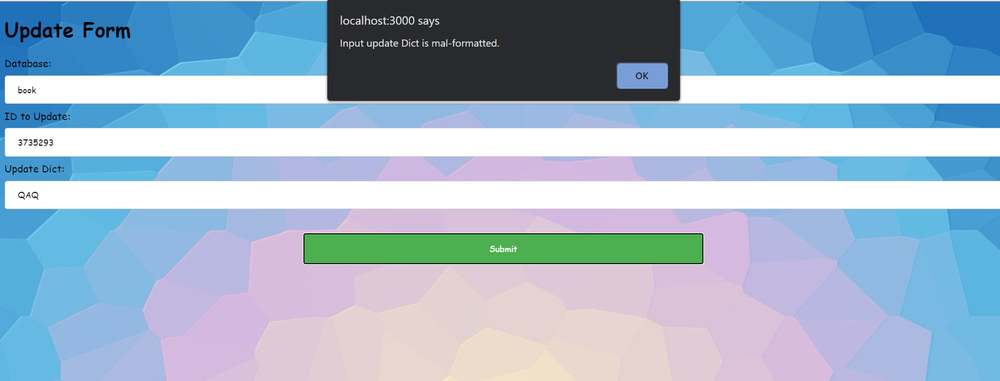
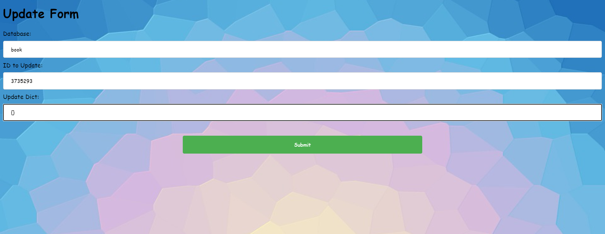
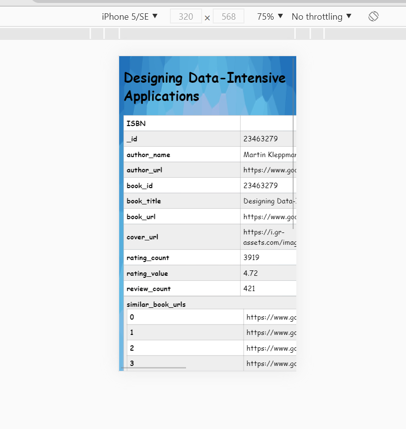

# React Single-Page-App Manual Test

Table of Contents
-----------------

* [Introduction](#Introduction)
* [Requirements](#Requirements)
* [Get Test](#GetTest)
* [Put Test](#PutTest)
* [Post Test](#PostTest)
* [Get Test](#DeleteTest)
* [Top-K Test](#TopKTest)
* [Overflow Test](OverflowTest)

## Introduction

Assignment-2.2 implements a single-page-application implemented with React.js ( which can be found in `goodread_visualizer` directory) that provides the following functinality:

- `GET` Request Visualizer
  - (i) Find one book/author with provided ID;
  - (ii) Do elastic search with provided query string.
- `PUT` Request Visualizer
  - Provide a form to change values of existing objects in database.
- `POST` Request Visualizer
  - (i) Provide book/author form to insert one new instance into the database.
  - (ii) Provide scrape form to send request to backend server to scrape new data.
- `Delete` Requets Visualizer
  - Delete one book/author with provided ID.
- Top-K Book Visualizer
  - Provide a K-adjustable visualzer (bar chart) for demonstrating the top K rated books implemented with d3.js.
- Top-K Author Visualizer
  - Provide a K-adjustable visualzer (bar chart) for demonstrating the top K rated authors implemented with d3.js.

Environment
-----------

JavaScript

- react.js
- d3.js
- mateiral UI
- react-paginate
- react-json-to-table

OS

- Windows

Notice these are only environment where this software got developed and is guranteed to run. They are not meant to be hard requirements.

Also notice one will have to have access to the author's remote MongoDB to actually run with existing DB. Otherwise please configure the MongoDB setting properly to run!

## Get Test

### Test -1.1 Find Valid Book

JSON Correctly fetched and rendered!

### Test -1.2 Find Non-Existing Book

We've got good error report.

### Test -1.3 Elastic Search One Result

There's only one page of results, which is what we expect.

### Test -1.4 Elastic Search Many Results

We got 6 pages of results, which is what we expected.

### Test - 1.5 Bad Elastic Query

We then get the correct error report.

### Test - 1.6 Elastic Query 0 Result

Again, good error report.

## Put Test

### Test - 2.1 Existing Book, Good Update JSON

Initial values as below:

Update `book_id` to `duckduckgo`

Good success report & value successfully update!

### Test - 2.2 Existing Book, Malformatted Input

We got a alert window for the malformatted input & request won't be sent.

### Test - 2.3 Existing Book, Non-Existing Update Key

Correct error report!

### Test - 2.4 Existing Book, Empty Update Dict

### Test - 2.5 Updating Non-Existing Book

## Post Test

### Test - 3.1 Upload Many Books

According to Bailey Tichner's anwer on campuswire, users should send post request to `api/{books, authors}` directly, instead of filling forms.

### Test - 3.2 Upload One Valid Book

This is the book form user will have to fill.

We get correct success message & we can find this in book database with correct information!

### Test - 3.3 Upload One Valid Author

### Test - 3.4 Bad Upload Form Submission

Submitting blank form:

Submitting non-convertable numeric string in `rating_value/rating_count/review_count`.

### Test - 3.5 Bad Scrape Form Submission

Bad numeric string

Bad URL

### Test - 3.6 Good Scrape Form Submission

Server log implies the request is successful &

We've got good success report.

## Delete Test

### Test - 4.1 Delete Existing Book

Notice book with id 3735293 can be found using get id (Test 1.1).

Now we've got correct success message & book has been removed.

### Test - 4.2 Delete Non-Existing Book

Correct error report. 

## Top-K Test

### Test - 5.1 Functionality of Top-K Books

5 books

10 books

20 books

Route is update correctly.

Users can use the slider to real-timely adjust `K`.

Xtick is clickable.

### Test - 5.2 Functionality of Top-K Authors

10 authors

20 authors

Route is update correctly.

Users can use the slider to real-timely adjust `K`.

Xtick is clickable.

## Overflow Test

### Test 6.1 OK/FAIL Scences

### Test 6.2 Scollable Rendered JSON

### Test 6.3 Scollable Top-K Visualization

### Test 6.4 Scalable Forms

### Test 6.5 Adaptable Buttons

